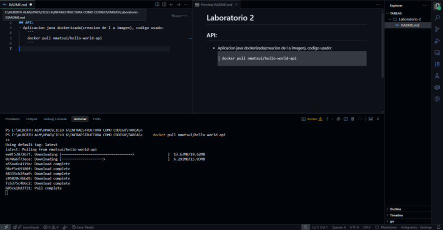
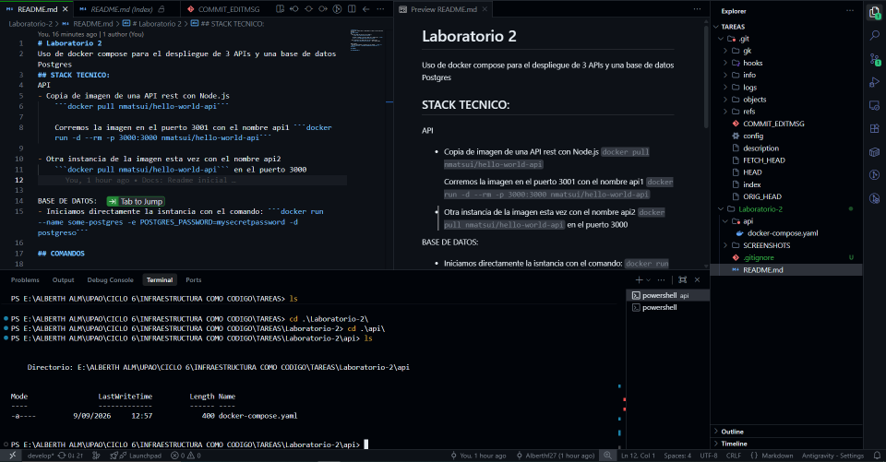
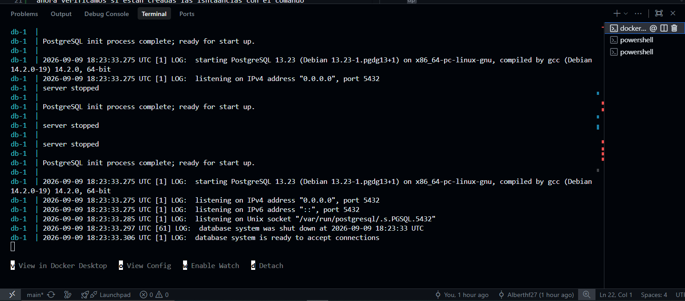
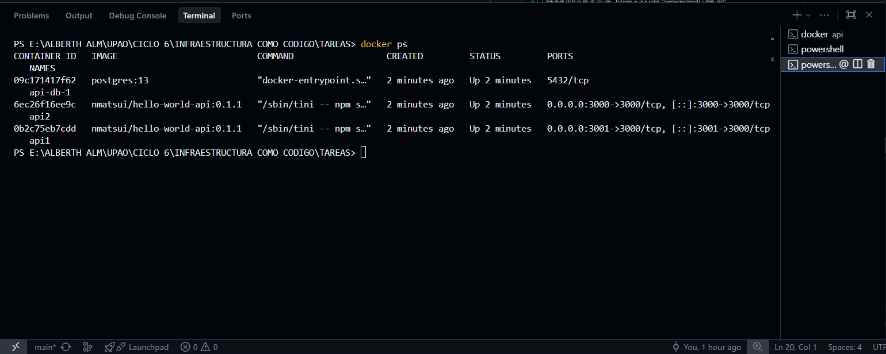

# Laboratorio 2
Uso de docker compose para el despliegue de 3 APIs y una base de datos Postgres

# Rspuesta a la tarea
## Tipos de redes en docker
Existen 4 tipos de redes que sirven para cada cosa diferente 

Puente: Es elcontrolador de red predeterminado y que permite que los contenedores bejo una misma red puedan conocerse entre si

Host: 	Elimine el aislamiento de red entre el contenedor y el host Docker.

Overlay: Conecta múltiples demonios de docker entre sí.

Macvlan: Coloca una direccion mac a cada docker para que asi quede totalemtne aislado

None: Desactiva todo tipo de conexion entre contenedores

## Tipos de volumenes que existen en docker

Volumenes Anonimos: Son los que se crean demanera automatica al crear el contenedor y crean hash para que puedan usarlos como identificador.

VOlumenes con nombre: El propio docker se encarga de administrar su ruta especifica en una ruta especifica y el nombre lo define el usuario.

Montajes de enlace: Permiten usar cualquier ruta absoluta en el host. Sirven para poder encontrar cualquier archivo en la pc anfitriona


## STACK TECNICO:
API
- Copia de imagen de una API rest con Node.js 
    ```docker pull nmatsui/hello-world-api``` 

    

    Corremos la imagen en el puerto 3001 con el nombre api1 ```docker run -d --rm -p 3000:3000 nmatsui/hello-world-api```

- Otra instancia de la imagen esta vez con el nombre api2
    ```docker pull nmatsui/hello-world-api``` en el puerto 3000

- tercer instancia de la imagen esta vez con el nombre api2
    ```docker pull nmatsui/hello-world-api``` en el puerto 3002


BASE DE DATOS:
- Iniciamos directamente la isntancia con el comando: ```docker run --name some-postgres -e POSTGRES_PASSWORD=mysecretpassword -d postgres○```
- Configuramos los volumenes para la persistencia de datos colocando la ruta en la que se guardara los datos:
```postgres_data:/var/lib/postgresql/data```

## COMANDOS
- Realizamos la creacion de el archivo docker-compose.yaml y verificamos 




Luego de eliminar las instancias creadas, pasamos a crear de manera declarativa haciendo uso del yaml con el comando: 
```docker compose up```



ahora verificamos si estan creadas las isntaancias con el comando ```docker ps``` y visualizamos la salida:



## CONFIGURACION ES
